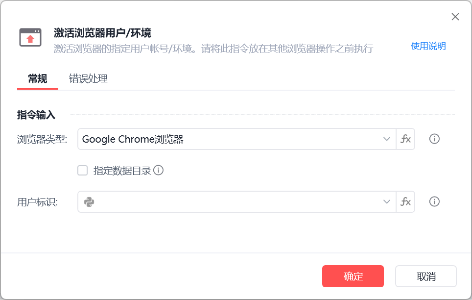
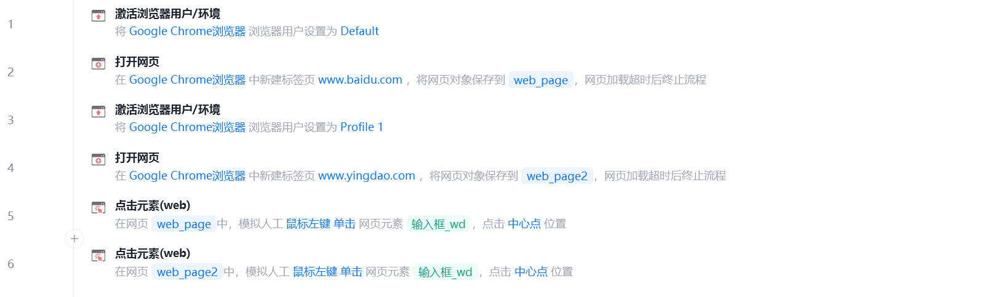
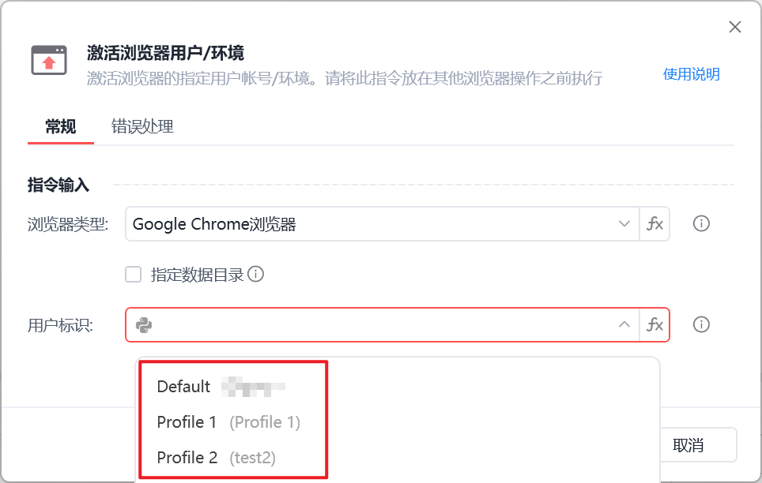

# 选择浏览器用户

激活浏览器用户/环境
💡

当浏览器存在多个用户/账号时，能够指定目标浏览器的用户环境

一、简介

当有多个浏览器用户被打开时，使用此指令指定目标的用户环境。支持谷歌浏览器、跨境/指纹浏览器等Chrome 内核浏览器。

二、说明
参数说明：

浏览器类型：

指定需要操作的浏览器类型（暂时只支持Google Chrome和Edge）

指定数据目录：

可选项，允许手动指定浏览器的用户数据目录（User Data Dir）。

若未勾选，则使用浏览器的默认用户数据目录

用户标识：

设置具体的浏览器配置文件（Profile），如“Profile 1”。

使用示例

如上流程完成以下操作

使用 Default 用户环境，打开百度首页并点击。

切换至 Profile 1 用户环境，打开影刀商城并点击相应元素。

三、常见问题

问：为什么我看不到我的浏览器用户名称？

答：请依次检查以下设置：

确认为Chromium浏览器：此指令目前仅支持 Chromium 内核浏览器（如 Google Chrome、Microsoft Edge）。不支持其他浏览器类型。

有效用户标识和数据目录：

用户标识（Profile）必须是当前浏览器已存在的有效名称，例如“Default”或“Profile 1”。

数据目录（User Data Dir）路径需确保正确且可用。

用户标识名称规则：用户标识名称仅支持浏览器自动生成的格式（如"Profile 1"）或包含英文字母和数字的自定义名称。

默认数据目录的使用：若未勾选“指定数据目录”，指令将使用浏览器的默认数据目录路径。请确保目标浏览器已至少启动过一次（首次启动会自动创建默认数据目录）。

插件依赖：执行操作前，请确保浏览器环境已正确安装并启用影刀插件。

## 参数截图

