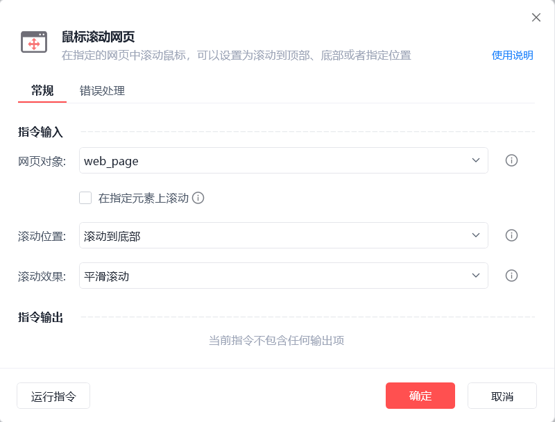

# 鼠标滚动网页

鼠标滚动网页
💡

在指定的网页中滚动鼠标，可以设置为滚动到顶部、底部或者指定位置

网页对象

选择一个之前通过【打开网页】或【获取已打开的网页对象】指令创建的网页对象

在指定元素上滚动

滚动效果作用于选中的操作目标之上，若当前操作元素无滚动条，支持自动向上查找滚动条元素

滚动位置

滚动到底部/顶部/指定位置/一屏

滚动效果

平滑滚动/瞬间滚动

使用示例

此流程执行逻辑：打开影刀官网 --> 使用【鼠标滚动网页】将鼠标平滑滚动到底部

## 参数截图

